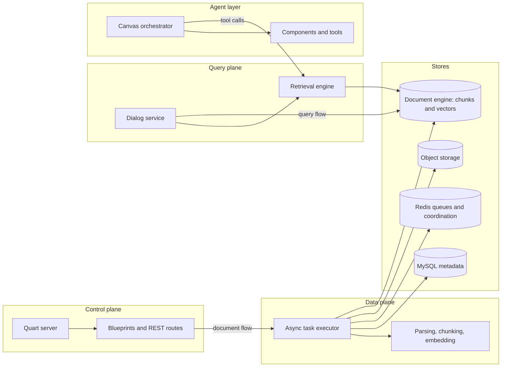

# The Big Picture

## Overview

RAGFlow turns documents into retrievable knowledge, answers questions with citations, and runs agent workflows on top of the same indexed corpus. This guide uses the Python implementation as the canonical system map, even though the repository also carries an in-flight Go rewrite.

## Domain object spine

The core lifecycle runs through `Knowledgebase` → `Document` → `Task` → chunk retrieval data. `Knowledgebase`, `Document`, and `Task` live as relational rows in `api/db/db_models.py`, while chunk text, vectors, and search behavior live outside SQL in the pluggable document engine behind `common/doc_store/doc_store_base.py` and `rag/nlp/search.py`.

That split keeps metadata transactional while the document engine owns chunk storage, vector search, and retrieval semantics.

## Three planes, one system

### Control plane

The HTTP control plane starts in `api/ragflow_server.py` and assembles the Quart application and its blueprints in `api/apps/__init__.py`. The REST surface in `api/apps/restful_apis/` manages datasets, tasks, and chat sessions.

### Data plane

The async ingestion plane runs in `rag/svr/task_executor.py`, which consumes `Task` rows through the Redis streams behind the queue names in `common/settings.py`. It parses source files, creates chunks, generates embeddings and metadata, and writes the resulting chunk records into the document engine. See [/02-anatomy-of-ingestion.md](/02-anatomy-of-ingestion.md).

### Query plane

The query plane begins in `api/db/services/dialog_service.py` and flows through `rag/nlp/search.py`. `dialog_service` shapes the conversation state, retrieval settings, citations, and answer assembly, while `search.py` executes chunk search, reranking, and citation insertion against the document engine. See [/01-anatomy-of-a-query.md](/01-anatomy-of-a-query.md).

## System map

## Agent workflows

`agent/canvas.py` runs the Canvas workflow engine built from `agent/component/` and `agent/tools/`. It coordinates multi-step agent runs, and some tools call back into retrieval so agent actions reuse the same knowledge base and chunk semantics as chat. See [/06-the-canvas-orchestrator.md](/06-the-canvas-orchestrator.md).

## Supporting systems

- `deepdoc/` handles parsing and vision so raw files become structured content before chunking. See [/08-deepdoc.md](/08-deepdoc.md).
- `rag/llm/` wraps multiple model providers behind a single model abstraction. See [/04-the-embedding-layer.md](/04-the-embedding-layer.md).
- `rag/graphrag/` adds knowledge-graph retrieval and graph artifacts for datasets that need more than flat chunk search. See [/05-graphrag.md](/05-graphrag.md).
- `common/doc_store/` defines the document-store interface that lets different backends store chunks and serve vector search through the same API. See [/07-the-doc-engine-abstraction.md](/07-the-doc-engine-abstraction.md).

For operator-facing behavior, the official guides cover [knowledge base configuration](https://ragflow.io/docs/dev/configure_knowledge_base), [child chunking strategy](https://ragflow.io/docs/dev/configure_child_chunking_strategy), [knowledge graph construction](https://ragflow.io/docs/dev/construct_knowledge_graph), [retrieval testing](https://ragflow.io/docs/dev/run_retrieval_test), [agent introduction](https://ragflow.io/docs/dev/agent_introduction), and [RAG basics](https://ragflow.io/basics/what-is-rag).

## Infrastructure footprint

`common/settings.py` and `conf/service_conf.yaml` define the deployment shape that the rest of the system assumes. MySQL stores dataset, document, task, and dialog metadata; Redis carries queue state and coordination signals; object storage such as MinIO holds raw files and other binary artifacts; and the document engine stores chunks, vectors, and search indices.

The same settings module wires `docStoreConn`, `retriever`, and `kg_retriever` to the selected backend so control plane requests and worker jobs share one retrieval stack.

## Migration note

As of mid-2026, the repository also includes an in-flight Go rewrite in `cmd/` and `internal/`. This guide treats the Python engine as canonical.

## Where to look in the code

- `api/ragflow_server.py` — boots the HTTP server, database, plugins, and background workers.
- `api/apps/__init__.py` and `api/apps/restful_apis/` — assemble the Quart app and REST routes.
- `api/db/db_models.py` — defines the relational backbone for the domain rows.
- `api/db/services/knowledgebase_service.py`, `api/db/services/document_service.py`, `api/db/services/task_service.py`, and `api/db/services/dialog_service.py` — manage knowledge bases, documents, tasks, and chat orchestration.
- `rag/svr/task_executor.py` — parses sources, builds chunks, embeds content, and writes index data.
- `rag/nlp/search.py`, `common/settings.py`, `common/doc_store/doc_store_base.py`, and `agent/canvas.py` — handle retrieval, backend wiring, storage abstraction, and agent orchestration.