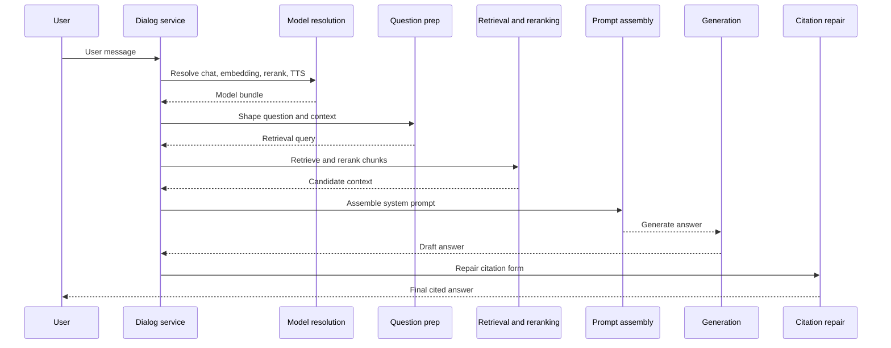

# Anatomy of a Query

This page traces one chat question through the Python stack, from the first user message to the final cited answer. `api/db/services/dialog_service.py` owns the main flow, while the surrounding layers split model resolution, question shaping, retrieval, reranking, prompt building, and citation cleanup into separate joints. That separation lets the system swap models and backends without rewriting the whole path.

## Series map

- [00 the big picture](./00-the-big-picture.md)
- [02 anatomy of ingestion](./02-anatomy-of-ingestion.md)
- [03 the chunking template zoo](./03-the-chunking-template-zoo.md)
- [04 the embedding layer](./04-the-embedding-layer.md)
- [05 graphrag](./05-graphrag.md)
- [06 the canvas orchestrator](./06-the-canvas-orchestrator.md)
- [07 the doc engine abstraction](./07-the-doc-engine-abstraction.md)
- [08 deepdoc](./08-deepdoc.md)
- [09 about this site](./09-about-this-site.md)

## Call path and configuration boundary

The normal query path starts in `async_chat(...)`. `async_chat_solo(...)` only takes over when the dialog has no knowledge base and no web search branch opens, so the fallback stays narrow and predictable. Before retrieval starts, `get_models(...)` loads the selected KBs with `KnowledgebaseService.get_by_ids(...)`, checks them with `validate_dataset_embedding_models(...)`, and then resolves the chat, embedding, rerank, and TTS bundles through the tenant model helpers. The chat tenant still owns the chat and rerank configuration, but the embedding model comes from the KB owner tenant, which keeps the KB inside its own vector space even when another tenant asks the question.

## Question shaping before retrieval

`full_question(...)` condenses recent turns into one question when the dialog asks for multi turn refinement. `cross_languages(...)` rewrites the question into the requested languages, and `keyword_extraction(...)` can append extra terms before `FulltextQueryer.question(...)` turns the string into a query object. The cross language term links to the glossary at [docs/references/glossary.mdx](docs/references/glossary.mdx).

The English branch treats the query as a weighted lexical search. It tokenizes the text, expands synonyms, and adds phrase boosts before it returns `MatchTextExpr(...)`. The Chinese branch splits on token boundaries, adds fine grained tokens, and still emits `MatchTextExpr(...)`, but it carries `minimum_should_match` so the backend can keep the intent intact. `Dealer.search(...)` starts with `minimum_should_match` at `0.3`, then drops to `0.1` when the first hybrid pass returns nothing and the dialog does not already pin the search to a specific document.

## Hybrid search as two legs

`common/doc_store/doc_store_base.py` defines the query language that keeps retrieval portable: `MatchTextExpr`, `MatchDenseExpr`, and `FusionExpr` describe intent, not storage syntax. `Dealer.search(...)` builds one full text leg and one dense leg, then joins them with `FusionExpr("weighted_sum", topk, {"weights": "0.05,0.95"})` so dense retrieval carries most of the weight. `internal/engine/infinity/chunk.go` consumes the same objects and applies engine side fusion with `normalize: atan`; ES and OceanBase follow the same shape for different reasons, since one keeps vectors in the index and the other still leans on local rerank against chunk vectors.

## Reranking and normalization

`rerank_by_model(...)` asks a provider reranker for scores, while `rerank(...)` and `rerank_with_knn(...)` blend keyword and vector similarity inside the search layer. The default blend uses `tkweight=0.3` and `vtweight=0.7`; at citation time `async_chat` replaces those values with `tkweight = 1 - dialog.vector_similarity_weight` and `vtweight = dialog.vector_similarity_weight`. `rag/llm/rerank_model.py` normalizes provider output to `[0,1]`, so the blend keeps the same meaning whether a provider returns relevance scores, cosine values, or raw logits.

## From chunks to prompt context

`kb_prompt(kbinfos, max_tokens)` turns each retrieved chunk into a labeled block and stops before the prompt overruns its budget. The sibling `async_ask` path uses `ASK_SUMMARY` as the compact wrapper around the same retrieval and citation machinery, so ask mode keeps the same ground truth but trims the surface form. `message_fit_in(...)` trims the conversation to `0.95 * max_tokens`, and `async_chat` then clamps `gen_conf["max_tokens"]` against the remaining room before it calls the model. The citation prompt joins the system message only when quoting stays on.

## Citations and repair

`insert_citations(...)` aligns answer sentences with chunks by comparing chunk vectors and token overlap. `dialog_service.py` calls `_hydrate_chunk_vectors(...)` on the ES path before scoring citations because the main retrieval call leaves chunk vectors in the index. `repair_bad_citation_formats(...)` then rewrites malformed markers such as `(ID: 12)`, `[ID: 12]`, `【ID: 12】`, and `ref12` so the final answer carries a consistent citation shape.

## Escape hatches

SQL gives the system a direct route for table shaped knowledge bases. `KnowledgebaseService.get_field_map(...)` supplies the schema, and `use_sql(...)` uses it to generate engine specific SQL before the flow falls back to chunk retrieval.

`retrieval_by_toc(...)` adds section aware context from the strongest document, while `retrieval_by_children(...)` rebuilds parent chunks from their children when the first pass returns fragments. Both steps refine the same initial candidate set instead of starting a separate search.

When `prompt_config.get("use_kg")` turns on, `async_chat` asks the graph retriever for an extra chunk and prepends it to the KB context; [05 graphrag](./05-graphrag.md) covers that branch in more detail. The web search gate stays a fallback boundary: `tavily_api_key` plus an explicit `internet` flag only extends the answer path when the main KB flow already runs.

For a hands on retrieval pass, see [docs/guides/dataset/run_retrieval_test.md](docs/guides/dataset/run_retrieval_test.md).

## Where to look in the code

- `api/db/services/dialog_service.py` — entrypoint, model resolution, SQL fallback, retrieval orchestration, prompt assembly, and citation repair.
- `api/db/joint_services/tenant_model_service.py` — tenant scoped model lookup and default selection.
- `api/db/services/knowledgebase_service.py` — KB lookup and embedding compatibility checks.
- `rag/nlp/query.py` — question shaping and `MatchTextExpr` construction.
- `rag/nlp/search.py` — hybrid retrieval, reranking, TOC and child expansion, and citation scoring.
- `rag/prompts/generator.py`, `common/doc_store/doc_store_base.py`, and `internal/engine/infinity/chunk.go` — prompt shaping, portable query objects, and Infinity fusion.