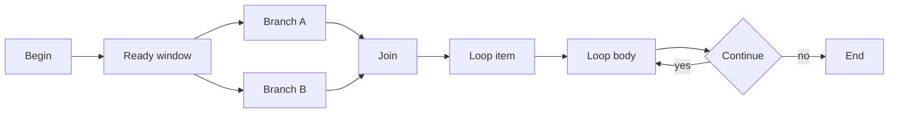

# The Canvas Orchestrator

## Overview

The visual editor and component option pages cover authoring details; this guide covers runtime behavior.

RAGFlow Canvas turns a visual workflow into a JSON DSL. The frontend edits that graph, `UserCanvas` stores the title, description, permissions, release state, category, tags, and DSL, and `Canvas` in `agent/canvas.py` loads the record, normalizes legacy shapes, instantiates the component objects, and executes the graph. Prebuilt workflows ship as JSON templates under `agent/templates/`.

## Mental model

The stored workflow record lives in `api/db/db_models.py` as `UserCanvas`. The runtime reads the DSL from that record, and `Canvas` extends `Graph` so one object can hold the graph in memory, the current path, history, retrieval results, globals, and runtime variables.

Canvas does not treat the DSL as static text. It turns each node into a component object from `agent/component/`, then walks the path list as a live schedule. The editor decides what to author; the runtime decides what to execute.

## Component contract

`ComponentParamBase` owns validation, inputs, outputs, retries, delay, and exception settings. `ComponentBase` reads resolved inputs, performs one unit of work, and writes outputs back to the component record. When a component raises an error, the wrapper can route to `exception_goto` or substitute `exception_default_value` instead of ending the run. The base resolver also expands `{component_id@field}`, `{sys.*}`, and `{env.*}` references in prompt text and input fields.

### Component families

- Control flow: `categorize`, `switch`, `iteration`, `loop`, `exit_loop`. These nodes choose the next branch or enter the body again until the stop condition fires.
- Model work: `llm`, `agent_with_tools`. These nodes build prompts, call the model, and let an agent use tools mid turn.
- Data shaping: `string_transform`, `data_operations`, `list_operations`, `variable_aggregator`. These nodes reshape text, objects, lists, and grouped variables.
- I/O: `begin`, `message`, `fillup`, `invoke`, `browser`. These nodes seed inputs, stream output, call HTTP endpoints, and drive browser tasks.

## Execution model

`Canvas.run` wraps each run with token usage and request context. `_run_impl` seeds the run from `begin`, refreshes `sys.date`, merges request inputs, handles `webhook_payload` for `Begin` in `Webhook` mode, and then drives the graph through a moving window over `self.path`. `_run_batch` collects the nodes in that window, runs async nodes on the event loop, and sends sync nodes through the thread pool under a semaphore that caps concurrency to the pool size.

The scheduler skips a node when its upstream value still lives outside the current path window, then tries again after the path expands. Ready branches can run in parallel because `_run_batch` creates tasks for everything runnable in the current window and waits for them together. Dependency order still matters, but the code does not promise a strict left to right visual order once concurrency and path mutation begin.

`IterationItem` and `LoopItem` re enqueue their bodies through the path update logic in `Canvas._run_impl`. `IterationItem` also exposes `item`, `index`, and `result`, with `result` kept as an alias for older canvases and downstream references.

## State and data flow

Canvas keeps globals for the active conversation: `sys.query`, `sys.user_id`, `sys.conversation_turns`, `sys.files`, `sys.history`, and `sys.date`. The runtime updates `sys.date` at run start, increments `sys.conversation_turns`, and appends each user turn to `sys.history`. Any `env.*` entry comes from the DSL `variables` table; the runtime refreshes those values from the saved variable definitions and falls back to an empty value that matches the declared type when the DSL supplies no explicit value.

`ComponentBase` resolves `{component_id@field}` references directly against component outputs, and it also resolves iteration aliases `item`, `index`, and `result` to the paired `IterationItem` outputs. `Begin` in `Webhook` mode turns a payload into runtime inputs by copying `input` into the `request` field and writing the remaining payload fields to outputs, which lets the canvas act like an API endpoint.

## Tools and components

Components schedule graph work; tools extend an LLM powered component after the scheduler picks a node. `Agent` in `agent/component/agent_with_tools.py` turns configured tool definitions into indexed tool names, binds them to `LLMBundle`, and adds MCP tools through the `mcp/` package when the canvas config includes them. Retrieval bridges back into the RAG retrieval stack and knowledge bases, so `Agent` can ground answers in indexed content rather than freeform guesses. See [Anatomy of a Query](/01-anatomy-of-a-query.md) for the retrieval path behind that bridge. Code execution uses the sandbox backend in `agent/sandbox/README.md`, which keeps host impact bounded while still allowing scripted work.

## Mermaid diagram

The diagram below shows two ready branches in the same window and a loop body that re enters the queue until the stop condition returns true.

## Dated notes

- The `mcp/` package keeps client and server hooks available for external systems that need to connect to RAGFlow.
- As of July 2026, `internal/agent/` carries an active Go runtime; this guide treats the Python canvas as canonical.

## Where to look in the code

- `agent/canvas.py` — DSL loading, runtime state, scheduler, and lifecycle.
- `api/db/db_models.py` — `UserCanvas` storage for the persisted DSL and release state.
- `agent/component/base.py` — shared input resolution, validation, and exception handling.
- `agent/component/begin.py`, `fillup.py`, `iteration.py`, `iterationitem.py`, `loop.py`, `loopitem.py` — entry input, interactive pauses, and repeated bodies.
- `agent/component/agent_with_tools.py`, `agent/tools/retrieval.py`, `agent/tools/code_exec.py`, `agent/component/browser.py` — model tools, retrieval, sandboxed code, and browser work.