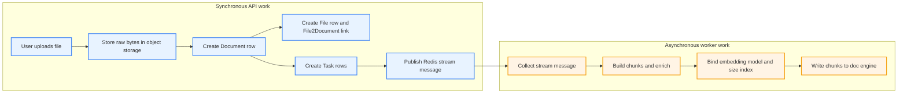

RAGFlow's ingestion path runs as an asynchronous data plane. The API writes SQL rows, stores file bytes, and publishes work; a separate worker consumes Redis streams and turns document slices into chunks, adds enrichment, builds embeddings, and writes search rows. The UI watches the SQL state that those services keep in sync.

## The pipeline at a glance

## Intake: bytes, records, and links

`FileService.upload_document()` writes raw bytes into object storage, creates the `Document` row for the dataset, and inserts the `File2Document` link that binds the file system view to the dataset record. `Document` carries the dataset scoped identity and parsing state, while `File` preserves the file system placement. That split lets RAGFlow represent the same content in more than one dataset without copying the blob.

## Work scheduling: turning one upload into many tasks

`queue_tasks()` in `task_service.py` fans a single document out into one or more `Task` rows. PDF files can split across page windows, and table files can split across row windows, so the worker handles bounded slices instead of one giant unit of work. `DocumentService.begin2parse()` marks the document as queued before the worker starts, and Redis streams plus consumer groups keep pending messages alive across worker restarts. The consumer loop in `rag/utils/redis_conn.py` reads the stream, tracks the pending set, and exposes queue lag so the UI can show honest progress.

## The worker: one long running orchestrator

`rag/svr/task_executor.py` runs as a standalone async process. `collect()` pulls the next message from the stream, and `do_handle_task()` routes the task into the right branch. The live worker handles standard parsing, RAPTOR, GraphRAG, Mindmap, memory, and dataflow work. The broader task family also names artifact and skill work, which keeps the queue model broader than plain parsing. GraphRAG follows the knowledge graph path described in [/05-graphrag.md](./05-graphrag.md), while the rest of this page stays focused on ingestion rather than downstream retrieval.

## Parse and chunk: choose the parser, then build chunks

`build_chunks()` treats parsing as a registry problem. It looks up the parser module from the `FACTORY` map using `parser_id`, fetches the raw file bytes from object storage, and calls the parser's `chunk()` method. That keeps file shape logic inside the parser zoo and leaves the worker to coordinate flow. The surrounding parser behavior belongs in [/03-the-chunking-template-zoo.md](./03-the-chunking-template-zoo.md) and [/08-deepdoc.md](./08-deepdoc.md), not here.

## Enrichment: turn raw chunks into better retrieval material

After chunking, the worker can layer extra signal onto each chunk: auto keywords, auto questions, metadata, tag assignment, and table of contents or PageIndex extraction. These layers do not replace the original chunks; they widen the search surface and give the retrieval stack more ways to land on the right answer.

RAPTOR adds a second structure on top of that base. The worker clusters related chunks, summarizes each cluster, and repeats that process on the summaries to build a tree of higher level chunks. The leaf chunks still matter, but the tree gives the system broader context for multi-hop retrieval. The same pass can run at file scope or dataset scope, depending on configuration, so one dataset can keep the summary tree narrow or make it shared across files.

## Embed and index: pin the model, size the index, write the rows

The worker binds the dataset's pinned embedding model before it starts indexing. It measures the vector length, passes that size into `init_kb()`, and uses it to initialize the knowledge base index so the document engine and embedding model agree on vector shape. `insert_chunks()` then writes the chunk rows through `settings.docStoreConn`, which makes the data searchable through the document engine abstraction described in [/04-the-embedding-layer.md](./04-the-embedding-layer.md) and [/07-the-doc-engine-abstraction.md](./07-the-doc-engine-abstraction.md).

## Feedback: keep SQL, Redis, and the UI in step

The worker and the API both write progress back into SQL so the UI never needs to inspect Redis directly. `TaskService.update_progress()` appends progress messages and completion state to each task row, while `DocumentService._sync_progress()` rolls those task rows up into the document row and keeps queue lag visible. Cancellation follows the same pattern: `cancel_all_task_of()` writes cancel flags into Redis, `has_canceled()` checks them in the worker, and `DocumentService.do_cancel()` lets the rest of the system short circuit work that no longer matters.

> As of July 2026, `rag/svr/task_executor_refactor/` and `rag/flow/` both hold active refactor work. This page describes the live orchestrator in `rag/svr/task_executor.py`.

## Where to look in the code

- `api/db/services/file_service.py` — stores raw uploads, creates `Document`, and links `File` to `Document`.
- `api/db/services/task_service.py` — fans out tasks, writes queue messages, and records cancellation and progress.
- `api/db/services/document_service.py` — keeps document state, chunk counters, and progress summaries in SQL.
- `rag/utils/redis_conn.py` — provides Redis streams, consumer groups, pending message iteration, and cancel flags.
- `rag/svr/task_executor.py` — collects tasks, builds chunks, adds enrichment, embeds content, and writes to the document engine.
- `rag/flow/pipeline.py` — the DSL-driven ingestion path that sits beside the classic orchestrator.